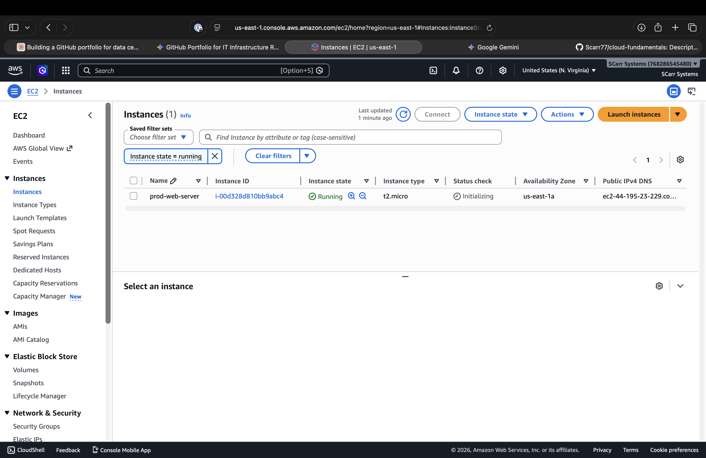

# Cloud Infrastructure & Systems Engineering Fundamentals

## 👨‍💻 About Me
Welcome to my technical portfolio. I am an Information Technology student specializing in Cloud Technology and Software Engineering. This repository serves as a centralized, public sandbox showcasing my hands-on enterprise lab work, automated systems scripting, and Infrastructure as Code (IaC) architectures.

---

## 🏗️ Repository Architecture & Core Modules

This repository is organized into distinct engineering pillars. Click into any directory to view the specific implementations, codebases, and deep-dive technical documentation:

### 1. 🤖 [Linux Automation](./linux-automation/)
* **Core Project:** Production-ready Bash scripting for automated systems health monitoring.
* **Concepts Demonstrated:** Linux CLI administration, custom enterprise log formatting (`syslog` simulation), automated safety threshold checking, and process metrics extraction (`df`, `awk`, `sed`).

### 2. 🔢 [Enterprise Networking Labs](./networking-labs/)
* **Core Project:** Architectural layout and programmatic design of a segmented corporate LAN.
* **Concepts Demonstrated:** IP Subnetting execution, explicit VLAN broadcast domain separation, 802.1Q trunking configuration, Cisco IOS CLI programming, and Inter-VLAN routing.

### 3. ☁️ [Cloud Infrastructure via IaC](./cloud-infrastructure/)
* **Core Project:** Automated declarative deployment of an isolated AWS network and compute stack.
* **Concepts Demonstrated:** Infrastructure as Code (IaC) best practices using **Terraform**, multi-tier AWS VPC provisioning, Internet Gateway edge routing configuration, stateful security group firewall definitions, and automated EC2 cloud server deployments.

---

## 🛠️ Tech Stack & Systems Toolkit
* **Operating Systems:** Linux (Ubuntu/RHEL Server environments), macOS
* **Infrastructure as Code / Cloud:** Terraform, Amazon Web Services (AWS)
* **Networking Standards:** TCP/IP, Cisco IOS CLI, Subnetting/VLSM, VLANs
* **Scripting / Development:** Bash Shell Scripting, Python, Git/GitHub, Cursor AI

## 📊 Live Deployment Verification
The following screenshot verifies a successful, live programmatic deployment of the `prod-web-server` compute instance via Terraform within the AWS account console footprint:

